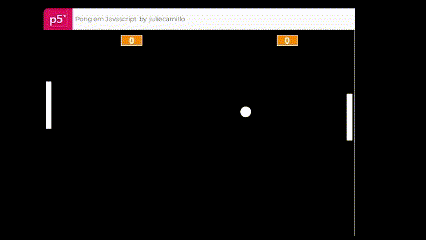

<h1 align="center"> Pong </h1>


O Pong é um jogo eletrônico com a temática de tênis de mesa e, é um dos primeiros jogos eletrônicos lucrativos da história.

🔗 [Acesse o projeto](https://editor.p5js.org/juliecamillo/full/bq9ex-QGu)


## Sumário do Projeto

* [Introdução](#introducao)
* [Como funciona](#como-funciona)
    * [Multiplayer](#multiplayer)
* [Tecnologias Utilizadas](#tecnologias-utilizadas)

<br>

# Introdução
O Pong é um jogo eletrônico com a temática de tênis de mesa e, é um dos primeiros jogos eletrônicos lucrativos da história e é a partir de sua criação que, na Alura, exercitamos nossa lógica de programação. 


# Como funciona

- No modo normal (como está originalmente):

Utilize as setas para cima e para baixo para mover a sua raquete e fazer pontos contra a raquete oponente.

- No modo multiplayer:

Para movimentar a sua raquete utilize as setas para cima e para baixo.    
Para movimentar a raquete do oponente: Teclas W e S.


## Multiplayer
O jogo foi programado para que a raquete do oponente seja automática, mas você tammbém pode jogar com um amigo que esteja do seu lado.
Para isso faremos uma pequena mudança no código.   
Aonde estiver o a função "movimentaRaqueteOponente" iremos comentar com duas barras (//), assim a função que automatiza a quete (já criada no código) não será lida. E assim, a raquete do oponente funcionará pelos comandos da função "movimentaRaqueteOponenteMultiplayer".

(Caso queira voltar para o modo automático, tire as barras da função "movimentaRaqueteOponente" e as coloque na função "movimentaRaqueteOponenteMultiplayer)

``` bash 
function draw() {
  background(0);
  mostraBolinha();
  movimentaBolinha();
  verificaColisaoBorda();
  mostraRaquete(xRaquete, yRaquete);
  movimentaMinhaRaquete();
  verificaColisaoRaquete(xRaquete, yRaquete);
  mostraRaquete(xRaqueteOponente, yRaqueteOponente);
  //movimentaRaqueteOponente();
  verificaColisaoRaquete(xRaqueteOponente, yRaqueteOponente);
  incluiPlacar();
  marcaPonto();
  movimentaRaqueteOponenteMultiplayer();
  bolinhaNaoFicaPresa();
}
 ```

# Tecnologias Utilizadas

- ``HTML5``
- ``CSS3``
- ``` JavaScript ```
- ``p5.js``
